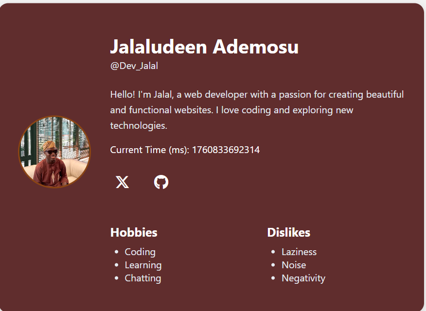

<!-- # Stage-Zero-HNG13

A Profile Card built using plain HTML, CSS, and Vanilla JavaScript.

Jalal’s Developer Profile Card

A clean, responsive, and accessible personal profile card showcasing my identity as a passionate web developer. Built with semantic HTML, modern CSS, and a focus on user experience, accessibility, and performance.

Profile Card Preview



✨ Features
Fully Responsive – Looks great on mobile, tablet, and desktop
Accessible – Follows WCAG guidelines with ARIA attributes and semantic markup
Minimal & Elegant Design – Dark-themed with warm accents
Lightweight – No frameworks, just vanilla HTML, CSS, and a touch of JavaScript
Social Links – Quick access to my Twitter and GitHub
Live Timestamp – Displays current time in milliseconds (updated via JS)
Technologies Used
HTML5 – Semantic structure with proper landmarks
CSS3 – Flexbox, custom properties (CSS variables), responsive media queries
JavaScript (Vanilla) – Dynamic time display
Font Awesome – For social media icons
Google Fonts Alternative – System-ui stack for fast loading
📁 Project Structure

profile-card/
├── index.html # Main HTML file
├── styles.css # Styling with CSS variables & responsive design
├── script.js # Live time update logic
└── avatar.jpg # Profile picture (120×120 recommended)
🚀 How to Use
Clone or download this project:
bash

1
2
git clone https://github.com/Jayboy2003/profile-card.git
cd profile-card
Add your own avatar:
Replace avatar.jpg with your image (square format recommended).
Customize content in index.html:
Name, bio, hobbies, dislikes
Social media links (Twitter, GitHub)
Open in browser:
bash

1
open index.html
💡 No build step required—just open the HTML file!

🌐 Live Demo
👉 View Live Demo
(Update this link once deployed to GitHub Pages)

Why This Project?
This profile card reflects my values as a developer:

Clarity over clutter
Functionality with beauty
Inclusive design for all users
It’s also a living snapshot of my current interests and online presence—perfect for embedding in portfolios, resumes, or personal websites.

🤝 Connect With Me
Twitter: @AdeyemiJalal
GitHub: Jayboy2003
LinkedIn: jalalademosu
📜 License
MIT © Jalaludeen Ademosu

💬 "Code is poetry. Design is empathy. Together, they build experiences."
— Jalal -->

# 🌐 Personal Portfolio Website

A modern, responsive, and accessible personal portfolio website built with HTML, CSS, and JavaScript. This project showcases web development skills through a multi-page application featuring a profile card, contact form with validation, and an about page with personal reflections.

## 🎯 Project Overview

This portfolio website was developed as part of a web development training program, demonstrating proficiency in:

- Semantic HTML5
- Modern CSS3 (Flexbox, Grid, Animations)
- Vanilla JavaScript
- Form Validation
- Responsive Design
- Web Accessibility (WCAG)

## ✨ Features

### 🏠 Home Page (Profile Card)

- **Dynamic Profile Card** with hover effects
- **Real-time Clock** displaying current timestamp in milliseconds
- **Social Media Links** (Twitter/X and GitHub)
- **Interests Section** showcasing hobbies and dislikes
- **Responsive Layout** adapting from mobile to desktop

### 📧 Contact Page

- **Fully Validated Contact Form** with:
  - Full name validation (required)
  - Email validation (proper format checking)
  - Subject validation (required)
  - Message validation (minimum 10 characters)
- **Real-time Error Messages** with ARIA support
- **Success Feedback** with auto-dismiss (5 seconds)
- **Keyboard Accessible** with proper focus management
- **Screen Reader Friendly** with proper ARIA labels

### 👤 About Me Page

- **Personal Biography** and background
- **Program Goals** and aspirations
- **Areas of Growth** (honest self-assessment)
- **Note to Future Self** (reflective writing)
- **Additional Thoughts** on learning and motivation
- **Semantic HTML Structure** for better SEO and accessibility

### 🎨 Design Features

- **Animated Gradient Background** with smooth transitions
- **Glassmorphism UI** with translucent cards
- **Hover Effects** and micro-interactions
- **Consistent Color Scheme** with CSS custom properties
- **Dark Theme** optimized for reduced eye strain
- **Responsive Navigation** with active state indicators
- **Professional Footer** with quick links and social media

## 🚀 Live Demo

[https://stage-zero-hng13.netlify.app/](#)

## 🛠️ Technologies Used

| Technology        | Purpose                                    |
| ----------------- | ------------------------------------------ |
| HTML5             | Semantic markup and structure              |
| CSS3              | Styling, animations, and responsive design |
| JavaScript (ES6+) | Form validation and interactivity          |
| Font Awesome      | Social media icons                         |

## 📁 Project Structure

```
portfolio-website/
│
├── index.html              # Home page (Profile card)
├── contact.html            # Contact form page
├── about.html              # About me page
│
├── styles.css              # Main stylesheet (all pages)
│
├── script.js               # Timer functionality for home page and form validation
├
│
├── avatar.jpg              # Profile picture
│
└── README.md               # Project documentation
```

## 🔧 Installation & Setup

### Prerequisites

- A modern web browser (Chrome, Firefox, Safari, Edge)
- A code editor (VS Code, Sublime Text, etc.) - optional
- A local server (optional, for development)

### Local Development

1. **Clone the repository**

   ```bash
   git clone https://github.com/Jayboy2003/portfolio-website.git
   cd portfolio-website
   ```

2. **Open with Live Server (Recommended)**

   - Using VS Code: Install "Live Server" extension
   - Right-click on `index.html` → "Open with Live Server"

3. **OR Open directly in browser**

   ```bash
   # Simply double-click index.html
   # OR
   open index.html  # macOS
   start index.html # Windows
   ```

4. **Replace placeholder content**
   - Update `avatar.jpg` with your profile picture
   - Edit personal information in all HTML files
   - Customize colors in `styles.css` (`:root` variables)

## 🎨 Customization

### Color Scheme

Edit CSS custom properties in `styles.css`:

```css
:root {
  --gradient-1: #1a0a0a; /* Dark red */
  --gradient-2: #2c0f0f; /* Medium red */
  --gradient-3: #3d1515; /* Light red */
  --card-bg: rgba(71, 11, 11, 0.95);
  --border-color: #8b4513; /* Saddle brown */
  --error-color: #ff6b6b; /* Error red */
  --success-color: #51cf66; /* Success green */
}
```

### Typography

Change font family:

```css
:root {
  --font-base: "Segoe UI", system-ui, sans-serif;
}
```

### Social Links

Update social media URLs in all HTML files:

```html
<a href="https://x.com/YOUR_USERNAME">...</a>
<a href="https://github.com/YOUR_USERNAME">...</a>
<a href="https://linkedin.com/in/YOUR_USERNAME">...</a>
```

## 📧 Setting Up Email Reception

The contact form currently validates but **doesn't send emails**.

## ✅ Testing Checklist

### Functionality

- [x] All pages load without errors
- [x] Navigation works between pages
- [x] Timer updates every second on home page
- [x] Social links open in new tabs
- [x] Form validation triggers on submit
- [x] Error messages display correctly
- [x] Success message shows and auto-dismisses
- [x] Form resets after successful submission

### Accessibility

- [x] All images have alt text
- [x] Proper heading hierarchy (h1 → h2 → h3)
- [x] Labels associated with form inputs
- [x] ARIA attributes for dynamic content
- [x] Keyboard navigation works throughout
- [x] Focus indicators visible
- [x] Color contrast meets WCAG AA standards

### Responsiveness

- [x] Mobile (320px - 599px)
- [x] Tablet (600px - 899px)
- [x] Desktop (900px+)
- [x] No horizontal scrolling
- [x] Touch targets at least 44x44px

### Browser Compatibility

- [x] Chrome/Edge (Chromium)
- [x] Firefox
- [x] Safari
- [x] Mobile browsers (iOS Safari, Chrome Mobile)

## 📊 Performance

- **Lighthouse Score:** 95+ (Performance, Accessibility, Best Practices, SEO)
- **Load Time:** < 2 seconds on 3G
- **Total Size:** < 500KB (including images)
- **No external dependencies** (except Font Awesome CDN)

## 🐛 Known Issues

- Email functionality requires backend implementation
- Timer shows milliseconds (not human-readable time) - this is intentional
- Font Awesome loads from CDN (requires internet connection)

## 🔮 Future Enhancements

- [ ] Add a projects/portfolio gallery page
- [ ] Implement dark/light theme toggle
- [ ] Add blog section
- [ ] Integrate with a CMS
- [ ] Add animations with GSAP or Framer Motion
- [ ] Progressive Web App (PWA) features
- [ ] Multilingual support (i18n)
- [ ] Add skills section with progress bars
- [ ] Testimonials/recommendations section
- [ ] Resume download functionality

## 📝 Learning Outcomes

Through this project, I've learned:

1. **Semantic HTML** - Proper use of HTML5 elements for better structure and SEO
2. **CSS Architecture** - Organizing styles with custom properties and modular approach
3. **JavaScript Fundamentals** - DOM manipulation, event handling, and validation logic
4. **Form Validation** - Client-side validation with proper error handling
5. **Responsive Design** - Mobile-first approach with media queries
6. **Accessibility** - WCAG guidelines and ARIA attributes
7. **Version Control** - Git workflow and documentation
8. **Problem Solving** - Debugging and iterative development

## 🤝 Contributing

This is a personal portfolio project, but feedback and suggestions are welcome!

1. Fork the repository
2. Create a feature branch (`git checkout -b feature/improvement`)
3. Commit your changes (`git commit -m 'Add some improvement'`)
4. Push to the branch (`git push origin feature/improvement`)
5. Open a Pull Request

## 📄 License

This project is open source and available under the [MIT License](LICENSE).

## 👨‍💻 Author

**Jalaludeen Ademosu**

- GitHub: [@Jayboy2003](https://github.com/Jayboy2003)
- Twitter: [@AdeyemiJalal](https://x.com/AdeyemiJalal)
- Linkedin: [@jalalademosu](https://linkedin.com/jalalademosu)
- Portfolio: [https://stage-zero-hng13.netlify.app/](#)

## 🙏 Acknowledgments

- [Font Awesome](https://fontawesome.com) for icons
- [MDN Web Docs](https://developer.mozilla.org) for documentation
- [W3C](https://www.w3.org) for web standards and accessibility guidelines
- My peers for feedback and support

## 📞 Support

If you have any questions or need help with setup:

- Open an issue in the [GitHub repository](https://github.com/Jayboy2003/portfolio-website/issues)
- Reach out on social media

---

⭐ **If you found this project helpful, please consider giving it a star!**

_Last updated: October 2025_
